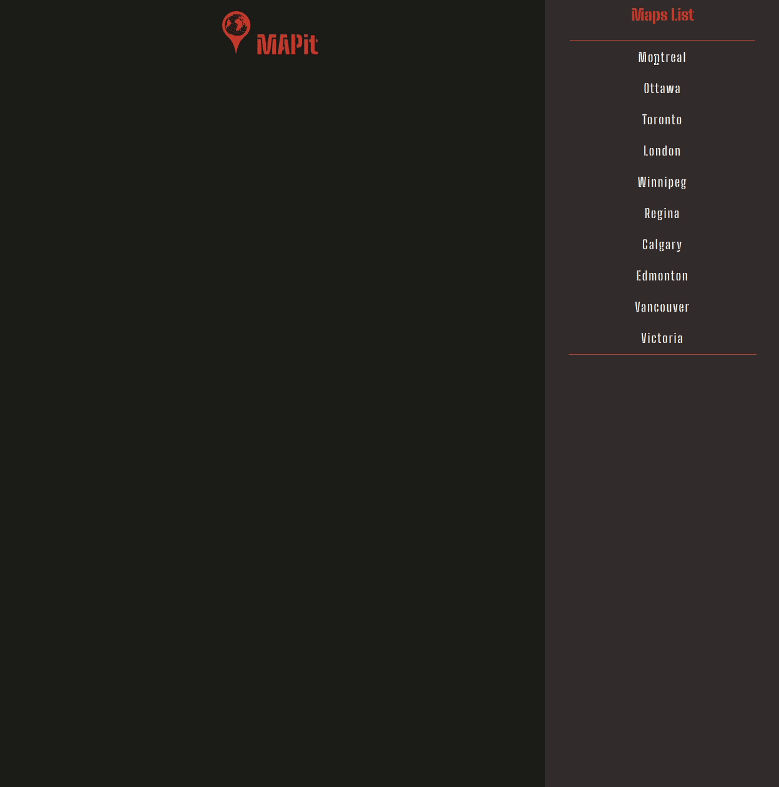
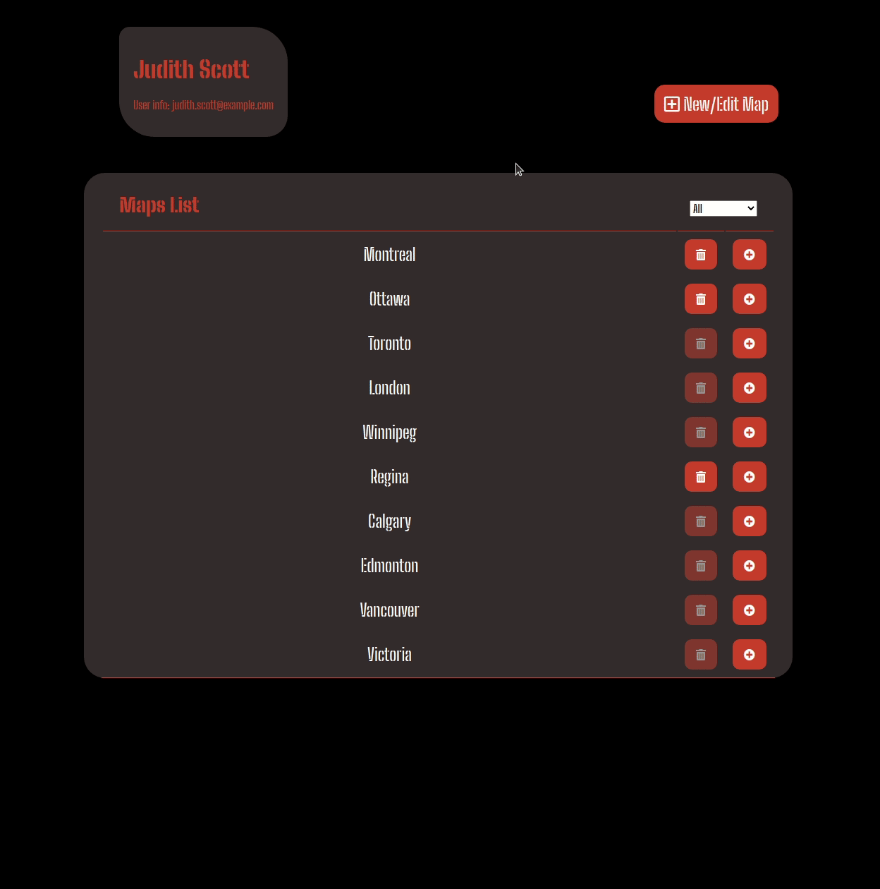
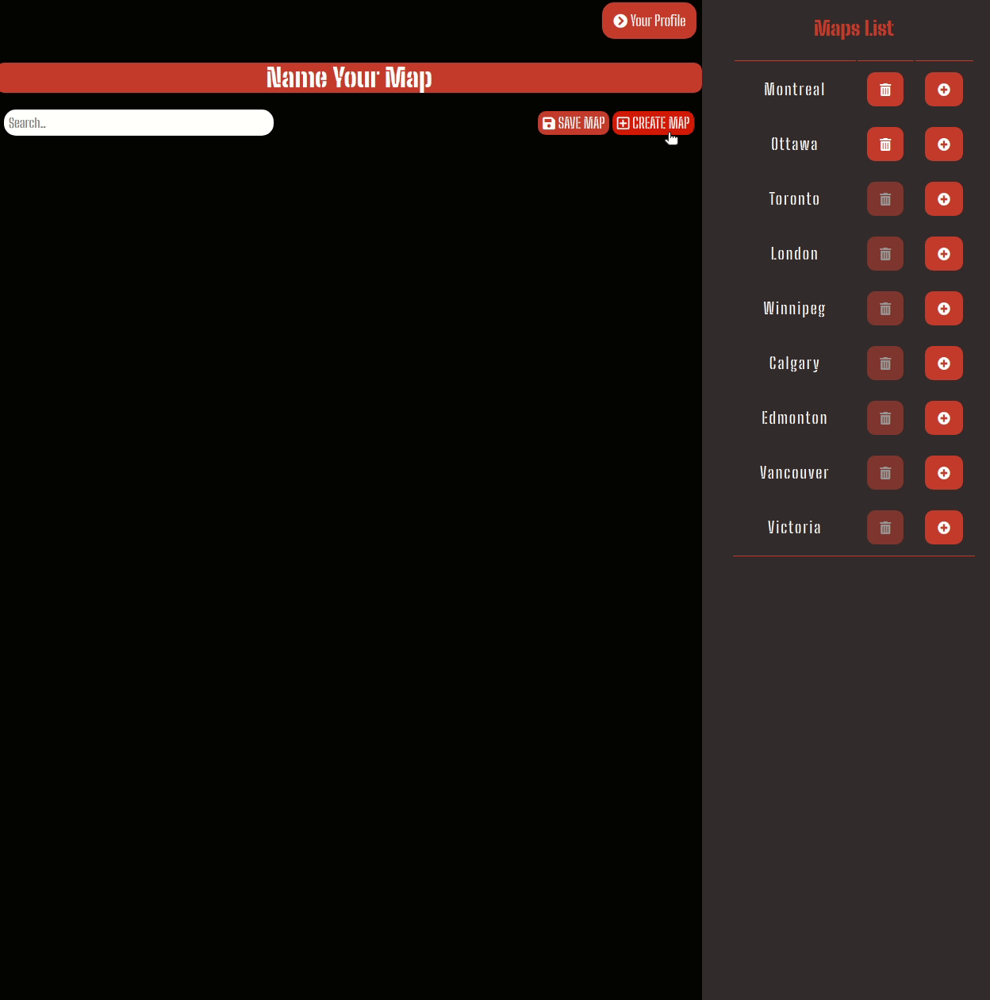

### MAPit is an application that allows users to view, create and share maps with custom points.

 
 

## Skills on Display

- [x] Express JS
- [x] HTML, CSS
- [x] jQuery
- [x] Ajax
- [x] Postgres  

## Features

- Non logged in users can see all the maps in the database
- Logged in users can see their profile
- Logged in users can filer maps by contributions, favourites, all
- Logged in users can delete maps they have created
- Logged in users can mark any map as a favourite
- Logged in users can create a new map and search for a particular place
- Maps can be satelite or street views
- Logged in users can double click on a map to drop a point
- Logged in users can right click on a point and Update: Name, Description, Rating
- Logged in users can save and delete points
- Logged in users can change the 'Name Your Map' to a custom name and save a map

---

## Getting Started

1. Install dependencies using the `npm install` command.
2. Create database & load details into .env
3. Run: `npm run db:reset`
4. Load Google Maps API key into: views/partials/header.ejs, views/map.ejs & user.ejs
5. Start the MAPit-api using the `npm start` command.
6. The app will be served at <http://localhost:8080/>.

---

## Dependencies & Dev Dependencies

- body-parser: 1.19.0
- chalk: 2.4.2
- cookie-session: 1.4.0
- dotenv: 2.0.0
- ejs: 2.6.2
- express: 4.17.1
- morgan: 1.9.1
- node-sass-middleware: 0.11.0
- pg: 6.4.2
- nodemon: 1.19.1
